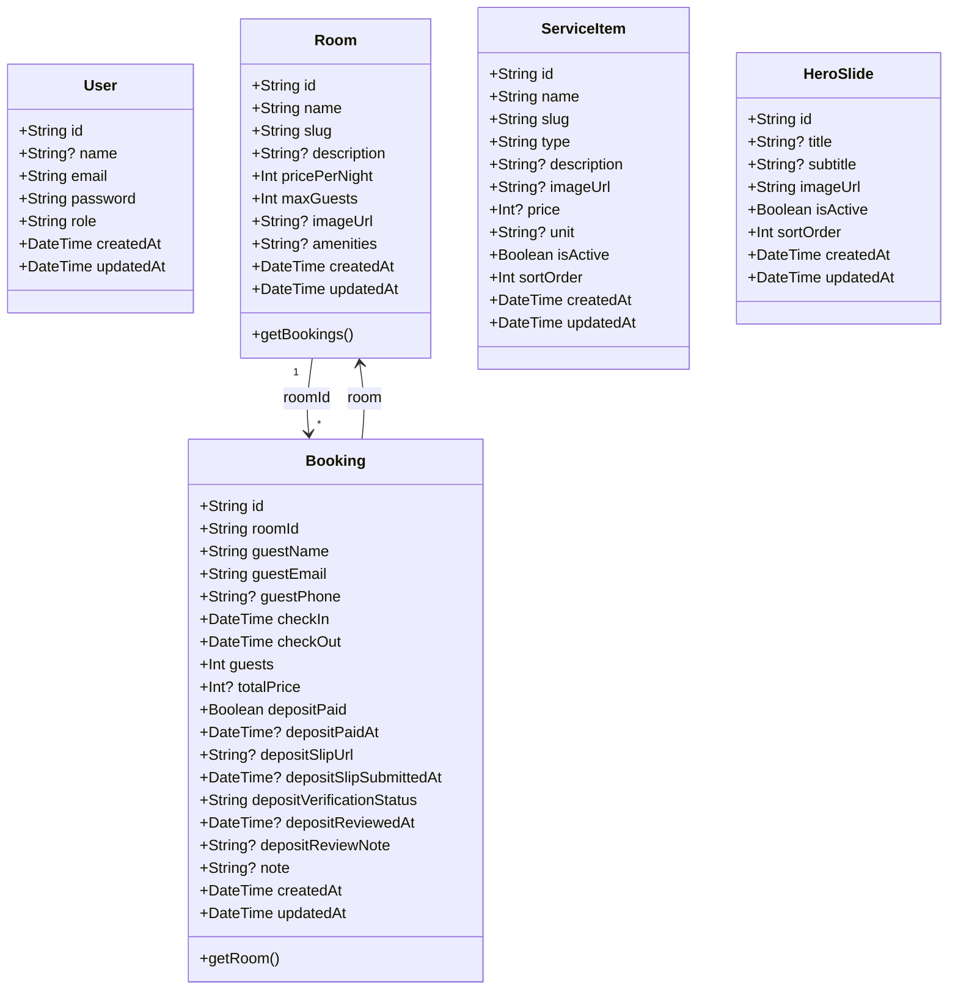
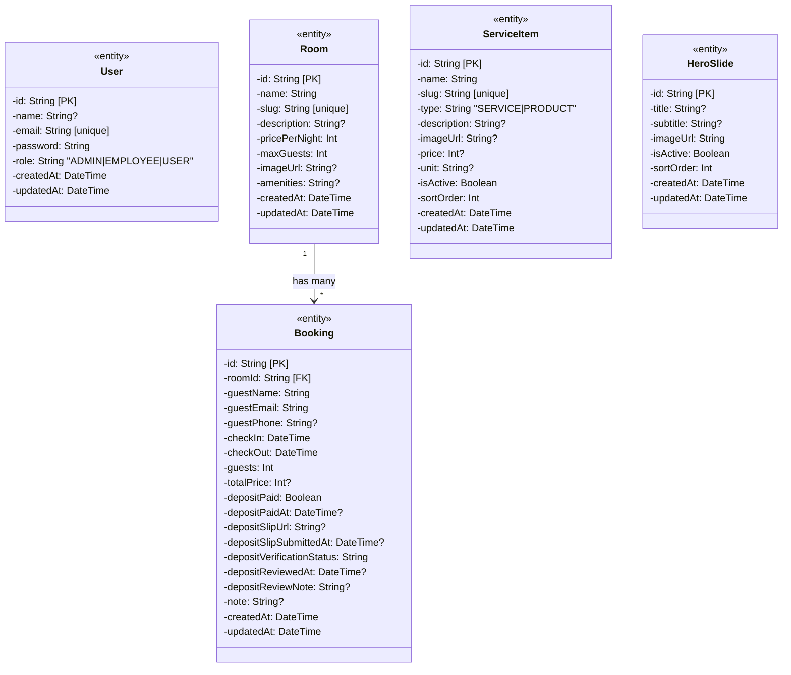

# Class Diagram — โปรเจค Homestay Booking

## Domain Model (จาก Prisma Schema)

---

## ความสัมพันธ์ระหว่างคลาส (อธิบาย)

| ความสัมพันธ์ | ประเภท | คำอธิบาย |
|--------------|--------|----------|
| **Room → Booking** | 1:N (One-to-Many) | ห้องหนึ่งห้องมีได้หลายการจอง (Booking มีฟิลด์ roomId ชี้ไปที่ Room) |
| **User** | ไม่มี FK ไปยัง Booking | การจองใช้ guestEmail เป็นตัวระบุ ไม่มี foreign key ไปที่ User (ความสัมพันธ์เชิงตรรกะ) |
| **ServiceItem** | ไม่มีความสัมพันธ์กับคลาสอื่น | ใช้แสดงสินค้า/บริการในหน้าเว็บ |
| **HeroSlide** | ไม่มีความสัมพันธ์กับคลาสอื่น | ใช้แสดงสไลด์บนหน้าแรก |

---

## Class Diagram แบบมีชนิดข้อมูลและข้อความอธิบาย

---

## Layer อื่น (อ้างอิงเท่านั้น)

ระบบใช้ Next.js App Router จึงไม่มีคลาสฝั่ง API แยกชัดแบบ OOP แต่มีกลุ่มหน้าที่หลักดังนี้:

| Layer | ที่อยู่ | หน้าที่ |
|-------|--------|--------|
| **API Routes** | `src/app/api/**/route.ts` | รับ HTTP request เรียก Prisma (อ่าน/เขียน DB) ส่ง response |
| **Pages** | `src/app/**/page.tsx` | แสดง UI และเรียก fetch ไป API หรือใช้ server component อ่านข้อมูล |
| **Components** | `src/components/` | UI ซ้ำใช้ร่วมกัน (เช่น AdminUI, HeroBackgroundSlideshow) |
| **ORM** | Prisma Client | สร้างจาก schema → ไม่ได้ประกาศคลาสในโค้ดโดยตรง แต่โมเดลใน schema สอดคล้องกับ Class Diagram ด้านบน |

---

*ไดอะแกรมอ้างอิงจาก `prisma/schema.prisma` — โมเดลจริงใช้ Prisma schema ไม่ได้เขียนเป็น class ใน TypeScript โดยตรง.*
