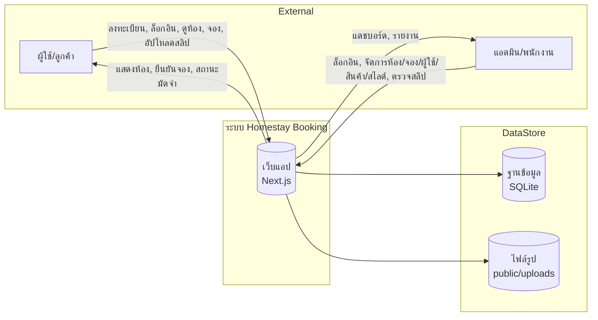
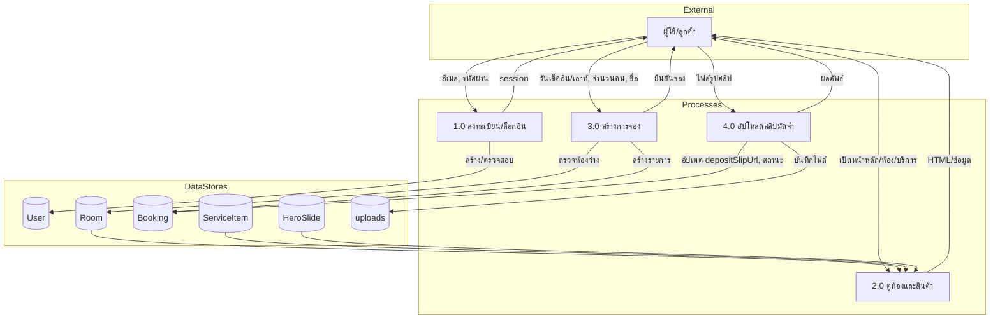
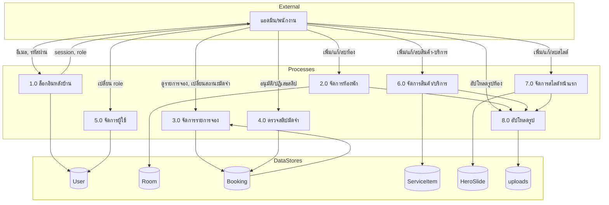

# DFD — โปรเจค Homestay Booking

## Level 0 (Context Diagram)

## Level 1 — ฝั่งผู้ใช้ (Guest)

## Level 1 — ฝั่งแอดมิน (Admin)

## สรุปกระบวนการหลัก (Process Summary)

| เลขที่ | กระบวนการ | ข้อมูลเข้า | ข้อมูลออก | Data Store |
|--------|-----------|------------|-----------|------------|
| 1.0 | ลงทะเบียน/ล็อกอิน | email, password, name | session, token | User |
| 2.0 | ดูห้องและสินค้า | - | หน้าเว็บ, รายการ Room/ServiceItem/HeroSlide | Room, ServiceItem, HeroSlide |
| 3.0 | สร้างการจอง | roomId, checkIn, checkOut, guests, guestName | bookingId, ยืนยัน | Room, Booking |
| 4.0 | อัปโหลดสลิปมัดจำ | bookingId, ไฟล์รูป | depositSlipUrl, สถานะ SUBMITTED | Booking, uploads |
| 2.0 (Admin) | จัดการห้องพัก | CRUD Room, รูป | อัปเดต Room | Room, uploads |
| 3.0 (Admin) | จัดการรายการจอง | ดู/กรอง/เปลี่ยนสถานะมัดจำ | รายงานจอง | Booking |
| 4.0 (Admin) | ตรวจสลิปมัดจำ | อนุมัติ/ปฏิเสธ + หมายเหตุ | depositPaid, depositReviewedAt | Booking |
| 5.0 (Admin) | จัดการผู้ใช้ | เปลี่ยน role | อัปเดต User | User |
| 6.0 (Admin) | จัดการสินค้า/บริการ | CRUD ServiceItem | อัปเดต ServiceItem | ServiceItem, uploads |
| 7.0 (Admin) | จัดการสไลด์หน้าแรก | CRUD HeroSlide | อัปเดต HeroSlide | HeroSlide, uploads |
| 8.0 | อัปโหลดรูป | ไฟล์รูป | URL path | uploads |

## หมายเหตุ

- การจองใช้ `getServerSession` เพื่อดึง guestEmail จาก User ที่ล็อกอิน
- หลังบ้านทุก process ตรวจสิทธิ์ role (ADMIN/EMPLOYEE) ผ่าน session หรือ middleware
