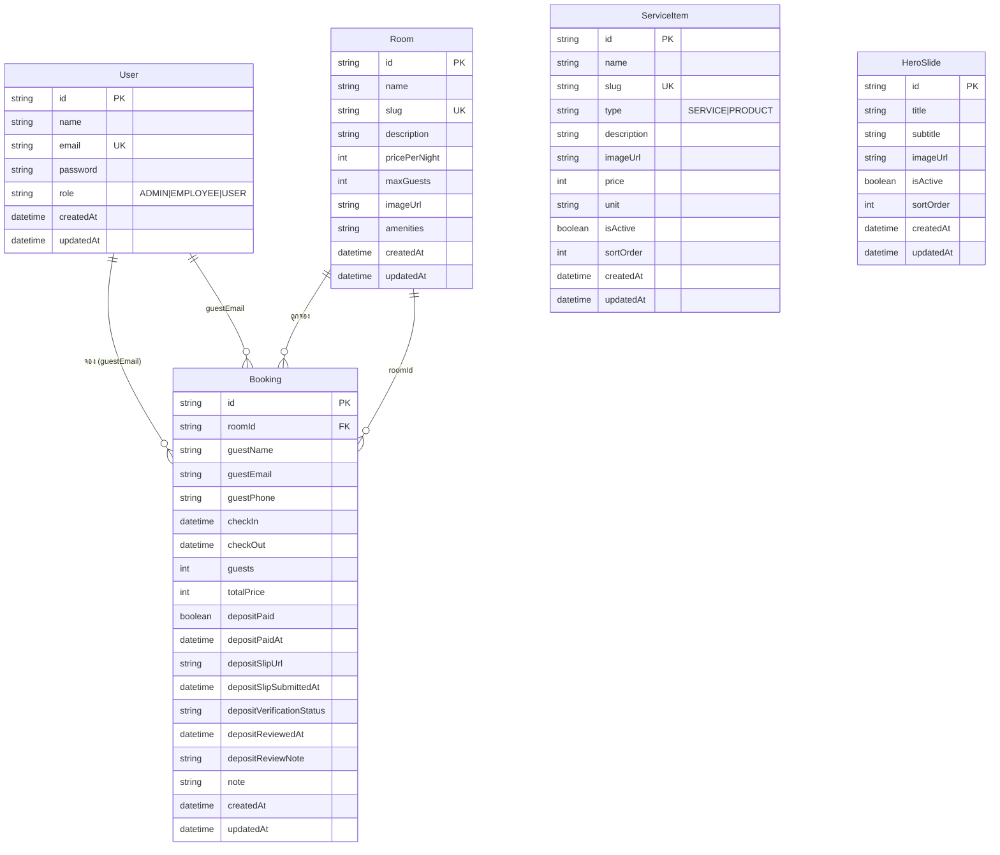

# ER Diagram — โปรเจค Homestay Booking

## Entity-Relationship Diagram (Mermaid)

## อธิบายความสัมพันธ์

| ความสัมพันธ์ | ประเภท | คำอธิบาย |
|--------------|--------|----------|
| **User — Booking** | 1:N (อ้างอิงด้วย guestEmail) | ผู้ใช้หนึ่งคนสามารถมีหลายการจอง (ใช้ email โยง ไม่มี FK โดยตรง) |
| **Room — Booking** | 1:N | ห้องหนึ่งห้องมีได้หลายการจอง (Booking.roomId → Room.id) |
| **ServiceItem** | ไม่มี FK | ใช้แสดงสินค้า/บริการบนเว็บ (จัดการในหลังบ้าน) |
| **HeroSlide** | ไม่มี FK | ใช้แสดงสไลด์หน้าแรก (จัดการในหลังบ้าน) |

## หมายเหตุ

- **User.role**: `ADMIN` | `EMPLOYEE` | `USER` (เก็บเป็น String ใน SQLite)
- **Booking.depositVerificationStatus**: `NONE` | `SUBMITTED` | `APPROVED` | `REJECTED`
- **ServiceItem.type**: `SERVICE` | `PRODUCT`
- ไฟล์อัปโหลด (รูปห้อง, สลิปมัดจำ) เก็บ path ใน DB (เช่น `imageUrl`, `depositSlipUrl`) ส่วนไฟล์จริงอยู่ที่ `public/uploads`
