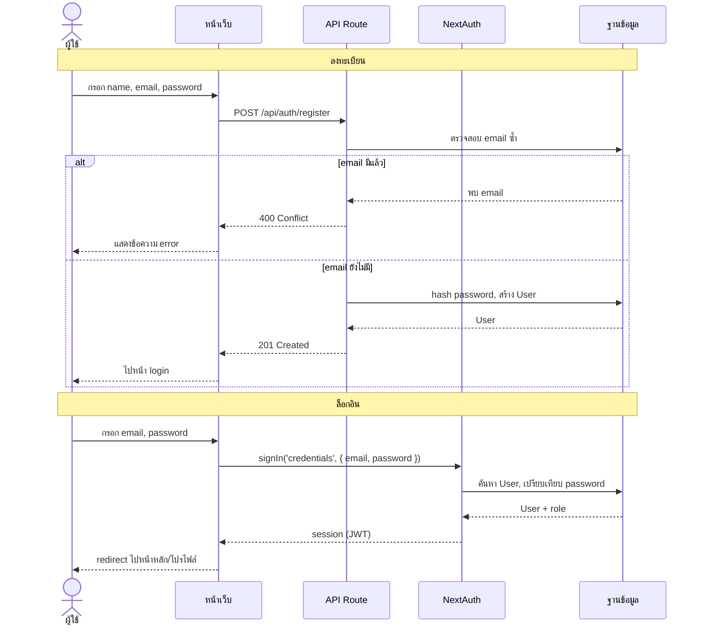
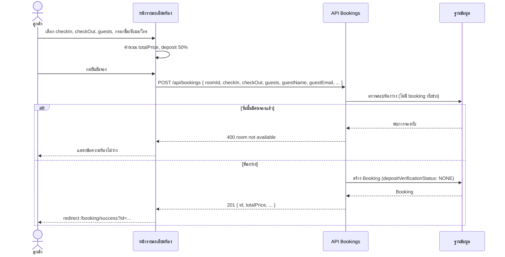
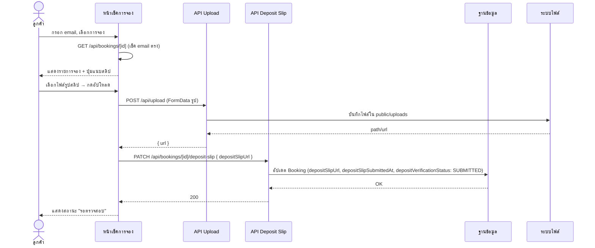
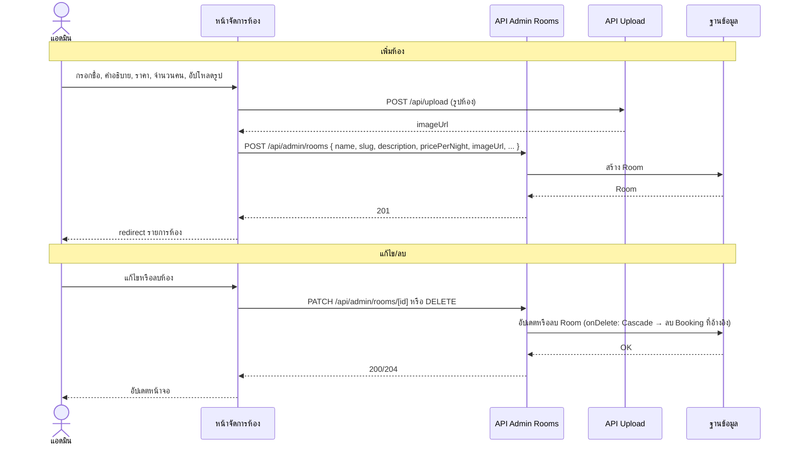

# Sequence Diagram — โปรเจค Homestay Booking

## 1. ลงทะเบียนและล็อกอิน (Register & Login)



---

## 2. การจองห้อง (Create Booking)



---

## 3. อัปโหลดสลิปมัดจำ (Upload Deposit Slip)



---

## 4. แอดมินตรวจสลิปมัดจำ (Admin Review Deposit)

```mermaid
sequenceDiagram
    actor Admin as แอดมิน
    participant AdminPage as หน้ารายการจอง (Admin)
    participant API as API Admin
    participant DB as ฐานข้อมูล

    Admin->>AdminPage: ล็อกอิน → เปิดหน้ารายการจอง
    AdminPage->>API: GET รายการจอง (หรือผ่าน server component)
    API->>DB: query Booking + Room
    DB-->>AdminPage: รายการจอง + สถานะมัดจำ

    Admin->>AdminPage: เลือกจองที่ส่งสลิปแล้ว → อนุมัติ/ปฏิเสธ
    AdminPage->>API: PATCH /api/admin/bookings/[id]/deposit-review { status: APPROVED|REJECTED, note? }
    API->>API: ตรวจสอบ session (role ADMIN/EMPLOYEE)
    API->>DB: อัปเดต depositVerificationStatus, depositReviewedAt, depositReviewNote; ถ้า APPROVED → depositPaid=true, depositPaidAt=now
    DB-->>API: OK
    API-->>AdminPage: 200
    AdminPage-->>Admin: อัปเดตตาราง/แสดงผลสำเร็จ
```

---

## 5. แอดมินจัดการห้อง (Admin CRUD Room)



---

## สรุปผู้ร่วมในไดอะแกรม

| ตัวย่อ / ชื่อ | ความหมาย |
|----------------|-----------|
| Page / หน้าเว็บ | Next.js page (client หรือ server component) |
| API Route | Route handler ใน `src/app/api/...` |
| NextAuth | การยืนยันตัวตน (signIn, session) |
| DB | Prisma + SQLite |
| FS | ระบบไฟล์ (public/uploads) |
